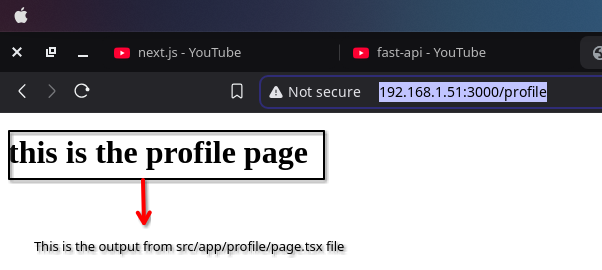
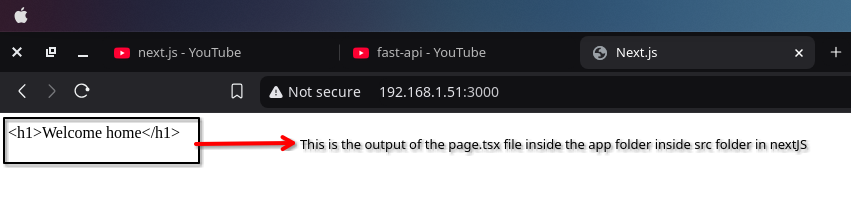
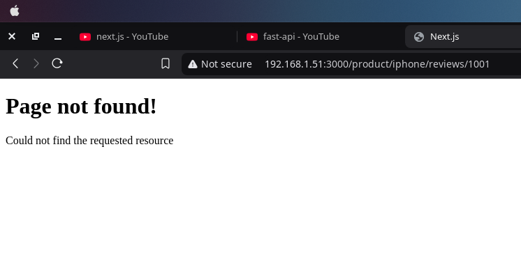
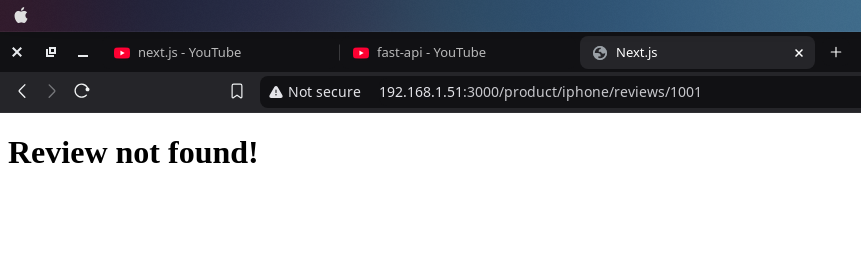

# NextJS learning content
# Summary : 
- Installation process
- TO run your nextJs project
- Project's folder structure
- Lets implement senario 2 : In this we need to create two additional route 1 for the about page ```localhost:3000/about``` and 1 for the profile page ```localhost:3000/profile``` page
- What is export default
- Lets implement senario 3 : In this we need to create three additional routes 1 for ```localhost:3000/blog``` 1 for ```localhost:3000/blog/first``` and 1 for ```localhost:3000/blog/second```
- Lets implement senario 4 : when a user hits the url ```localhost:3000/products``` he should see products listing and when a user hots the url ```localhost:3000/products/id``` he should see the product's detials
- Nested Dynamic routes
    - Consider senario 5 : Here we are showing product's detial in this route ```localhost:3000/product/1``` and we are showing review for product 1 like this ```localhost:3000/product/1/review/1
- Catch all segments
    - The ```?.``` operator is called "optional chaining.
    - What is a slug?
- Not found page
    - Show not found page programatically
        - The notFound() Function (from next/navigation)
    - You can also create specific 404 page for different sections of your application.
    - path name Hook from nextJs
## Installation process
- Install npm using this command ```sudo apt-get install npm```
- To install nextJS you need to run this command ```npx create-next-app@latest```
## TO run your nextJs project
- To tun your nextJs project all you need to do is run this command ```npm run dev```
## Project's folder structure
### First we have got package.json
This is where our project's dependencies and scripts live.      
For dependencies we have got the essentials : 
```
"dependencies": {
    "react": "^19.0.0",
    "react-dom": "^19.0.0",
    "next": "15.1.7"
  },
```
The script section is also pretty straight forward
```
 "scripts": {
    "dev": "next dev",
    "build": "next build",
    "start": "next start",
    "lint": "next lint"
  },
```
 - dev for development mode
 - build for production builds
 - start for running the production server
 - lint for sending out nextJs built in eslint configurations       
 
**NOTE** : ESLint is an open-source tool that helps you find and fix JavaScript errors in Next.js projects. It's a static code analyzer that helps you write better code, avoid bugs, and maintain consistent coding standards

### next.config.ts
This file is for nextJs settings
### tsconfig.json
This file is for typeScript configuration settings
### eslint.config.mjs
This file is for Eslint configurations
### tailwind.config.ts and post.css.config.mjs
This file is for tailwind configurations
### node_modules folder
This folder is the home of all our installed dependencies. This gets created when you run ```npm install``` or in this case when we run ```npm run dev``` this command handles the installation automatically when we try to run the development server of nextJs.
### public folder 
This is the folder where all your static files like images and svgs go.
### src folder
This folder contains the app folder which is the app router. This is where we will spend most of our time during development of any nextJs application.

## Explaination how it all work togeather
When we run ```npm run dev``` command .
- The execution starts from package.json
- Moves to layout.tsx rendering the RootLayout component
- For the url localhost 3000 it looks for the component in page.tsx within the app folder that is our home component.
- the page.tsx component is rendered inside the root layout.tsx 

## REACT Fundamentals necessary for understanding how to write nextJs code
### React Server Components (RSC)
This architecture introduces a new approach to creating React components by dividing them into two distict types.       
- Server Components : 
    - By default nextJs treats all components as server components. These components can perform server-side tasks like reading files or fetching data directly from a database.
    - The tradeoff is they can't use React hooks or handle user interactions.
- Client Components
    - If you want to create a client component then you will need to add the "use client" directive at the top of your component file.
    - While client component can't perform server side tasks like creating files they can use react hooks and handle interactions.
    - Think of client components as traditional react components you are already familiar with.

**NOTE:** React Hooks are functions that let you use React's state and lifecycle features in function components, instead of writing class components. Hooks make it easier to manage state, reuse logic, and write code. 
### Routing in nextJS
- NextKs has a file-system based routing system
- URls you can access in your browser are determined by how organized your files and folders are in your code.
- So does every folder in nextJs is converted into a url route in nextJs? The answer is no. 
- NextJs is built around conventions and routing is one area where these conventions are particularly important
    - There are three main conventions to remember.
        - All routes must live inside the app folder
        - Route files must be named either page.js or page.tsx
        - Each folder represents a segment of the url path
    - When these conventions are follwed the file automatically becomes available as a route. 
- NextJs will automatically serve a 404 not found response page when someone tries to access the url that you have not created in the app you don't have to do anything in this case since nextJs has got you covered.
- The beauty of this system is that you don't need to mess around with installing and configuring a router in your code your file and folder structure does all the heavy lifting.
- This is a perfect example of nextJs's philosophy of favouring conventions over configuration when it comes to routing.
    
**Lets implement the senario 1 : Where user hits the url ```localhost:3000```** :       

- As you can see the output here is an html tag which comes from ```src/app/page.tsx```
- With this we have completed the senario 1
- The code related to this is present inside this directory ```routing-demo/src/app/page.tsx```

**What is layout.tsx file** :       
- Even though I have deleted this file when I have deleted the app folder from src directory. The nextJS will automatically create and set it up we first access the root route.
- This file get created automatically behind the scene

**Lets implement senario 2 : In this we need to create two additional route 1 for the about page ```localhost:3000/about``` and 1 for the profile page ```localhost:3000/profile``` page**
- route : ```http://192.168.1.51:3000/profile```
    
- route : ```http://192.168.1.51:3000/about```
    
**NOTE: What is export default**        
- export default is used to export the profile function as the default export of this file.
- This allows you to import the profile function elsewhere in your application without needing to use curly braces. For example: 
```import Profile from './profile'; // Now 'Profile' can be used like a regular React component
```

**Lets implement senario 3 : In this we need to create three additional routes 1 for ```localhost:3000/blog``` 1 for ```localhost:3000/blog/first``` and 1 for ```localhost:3000/blog/second```**
- In this senario we trying to tackel nested routing 
- All you need to do is create a blog folder inside the app directiory and then create a page.tsx file 
    - write this code in that page.tsx file 
    - ```
            export default function blog(){
            return <h1>this is the blog home page</h1>
        }
        ```
- Then inside the blog folder you need to create two additional folder named first and second. Then add page.tsx inside each first and second folder and add the same code inside each of them with slight variations as shown below:
    - for ```app/blog/first/page.tsx```
        - ```
              export default function blog(){
            return <h1>this is the first blog page</h1>
            }
          ```
    - for ```app/blog/second/page.tsx```
        - ```
              export default function blog(){
            return <h1>this is the second blog page</h1>
            }
          ```
### Dynamic routing in NextJS
**Lets implement senario 4 : when a user hits the url ```localhost:3000/products``` he should see products listing and when a user hots the url ```localhost:3000/products/id``` he should see the product's detials**      
- ```routing-demo/src/app/product/[productid]/page.tsx``` when implementing dynamic routing the folder with square-brackets ```[]``` will serve as the dynamic route variable that will be passed in the url
- This variable can be get in the page.tsx file present inside this ```[productid]``` folder like this 
    - ```
        export default async function product_details({ params }: { params: Promise<{ productid: bigint }>}){
            const productid = (await params).productid
            return (
                <>
                <h1>Details about product {productid}</h1>
                </>
            )
        }
      ```
    - In real app you will have to fetch the product details using this productid from a back-end server In my case I am planning to use fast-api or django
- Now every page in the app router recieves route parameters with the params prop. Lets destructure it as params.
    - The type of params is a promise that resolves to an object containing the dynamic segments as key value pairs in my case ```{ params }: { params: { productid: BigInteger } }``` where ```productid``` is the name of the folder written in square brackets. 

**Nested Dynamic routes :**     
**Consider senario 5 : Here we are showing product's detial in this route ```localhost:3000/product/1``` and we are showing review for product 1 like this ```localhost:3000/product/1/review/1```**
- In this case we have to create a folder called product inside the app folder like this ```routing-demo/src/app/product``` 
- Then we will have to create a folder with a name wrapped in a square bracket Remember that these type of folders are the folders which allow us to implement dynamic routing in nextjs ```routing-demo/src/app/product/[productid]```
- Create a page.tsx file inside this folder ```routing-demo/src/app/product/[productid]/page.tsx```
    - the code below will allow us to get the value passed in the url into our page.tsx file's function 
        - ```
            export default async function product_details({ params }: { params:    Promise<{ productid: bigint }>}){
                const productid = (await params).productid
                return (
                    <>
                    <h1>Details about product {productid}</h1>
                    </>
                )
            }a
        ```
- Then create a folder inside ```[productid]``` folder called reviews and inside reviews you need to create another folder with a name reviewid wrapped in a square bracket it should look something like this ```routing-demo/src/app/product/[productid]/reviews/[reviewid]/page.tsx```
    - ```
        export default async function product_review({params} : {params : Promise<{productid : bigint,reviewid : bigint}>}){
        const {productid, reviewid} = (await params) 
            return (
                <>
                <h1>The review for product with a productid {productid} is as shown below</h1>
                <h4>The current review is {reviewid}</h4>
                </>
            )
        }
      ```
### Catch all segments
To understand this consider the senario 6.      
**Senario 6 : Imagine we are creating a document for our site and each site has multiple features and each feature contains several concepts that need documentation The goal is to create a unique routes for each concepts under its respective feature**        
Since next js uses file system routing that would mean we have to create 100 separate files in the project. But here is where the dynamic routing comes to the rescue. by using dynamic route folder by using concept_id you can cut that down to just 20 files. Similarly if we create a dynamic route folder for feature_id then we would be down to just 2 folders.      
Everytime we add a new path segment to our url ```localhost:3000/docs/feature1/concept1/example1``` we need another level of nesting our routes folder, since every page in our documentation shares the same layout wouldn't it be grate if we could handle all these routes segments with just one file. That is exactly catch all segments lets us do.       
#### Implementation : 
- First create a folder named ```docs``` inside the ```app``` folder. 
- Now create a dynamic folder which looks something like this ```[...slug]```
- Inside of ```[...slug]``` folder you create a page.tsx file
- And inside of that page.tsx file you write the code as shown below : 
    - ```
        export default function Docs(){
            return (<>
                <h1>Docs home page</h1>
            </>)
        }
      ```
- As a result you will see that any url after ```http://192.168.1.51:3000/docs/``` will be accepted and the page will shown as a result so your url may look something like this ```http://192.168.1.51:3000/docs/feature1/example12``` and it will work and your url may also look like this ```http://192.168.1.51:3000/docs/feature1``` which will also work.
- In order to access different url segment in the code in page.tsx file.
    - ```
        export default async function Docs({params,} : {params: Promise<{slug:string[]}>}){
        const {slug} = await params;
            if (slug?.length === 2){
                return (
                    <>
                    <h1>
                        Viewing docs for {slug[0]} and {slug[1]}
                    </h1>
                    </>
                )
            }
            else if(slug?.length === 1){
                return (
                    <>
                    <h1>
                        Viewing docs for {slug[0]}
                    </h1>
                    </>
                )
            }
            else{
                return (
                    <>
                    <h1>Docs home page</h1>
                    </>
                )
            }
        }
        ```
    - The ```?.``` operator is called "optional chaining." It allows you to safely access properties of an object (or call methods) even if that object is null or undefined.
    In this case, slug?.length means:
    If slug is not null or undefined, it will access the length property of the slug array (or string).
    If slug is null or undefined, the expression will short-circuit and return undefined rather than throwing an error.
    - Here ```slug:string[]``` is an array of strings which gives us the liberty to handle the params however we see fit.
- Right now if you go to this url ```http://192.168.1.51:3000/docs/``` you will see a 404 error. Which means the slug segments in your url is not optional and mandatory
- There is a way to make your slug segments in the url optional all you have to do is change your dynamic folder name from ```[...slug]``` to ```[[...slug]]``` and now the url ```http://192.168.1.51:3000/docs/``` will work as well triggering code written in the else block in the code as shown above  

**What is a slug?** In Django, a slug is a short, URL-friendly version of a string, typically used to create readable and SEO-friendly URLs. It is often used for titles, names, or other text that should appear in URLs.

For example, if you have a blog post titled "My First Blog Post!", the slug might be "my-first-blog-post", which is clean, readable, and easier to handle in URLs than the original title.      

### Not found page
Lets explore how to create a custom 404 page using an app router. By defualt if you visit a route that doesn't exist in your app folder you will see a basic 404 page. For development this default 404 page is good but for production you may want a custom 404 page that you want to show the users if they visit a route thats not there.       
You can do it simply by creating a file called ```not-found.tsx``` or ```not-found.js``` in your ```app``` folder.      
**Remember :** The file name should be exactly ```not-found.tsx``` or ```not-found.js``` in the app folder otherwise it will not work.      
#### Implementation
- Create a file named ```not-found.tsx``` in this directory ```routing-demo/src/app/not-found.tsx```.
- Then inside this file write this code as shown below:
    - ```
        export default async function NotFound(){
            return (
                <div className="flex flex-col items-center jutify-around">
                    <h1>Page not found!</h1>
                    <p>Could not find the requested resource</p>
                </div>
            )
        }
      ```
    - You can use this custom 404 page to match your websites theme and branding and make your website a bit more cohcohesive and complete.
- While this ```not-found.tsx``` page works automatically with nextjs file based routing you can also trigger it programmatically using the not-found function.     

**Show not found page programatically** : 
Lets say we are building a product review system. Where we will never have more than 1000 reviews and we want to show a 404 page for any review id above 1000. 
- ```
    import { notFound } from "next/navigation"

    export default async function product_review({params} : {params : Promise<{productid : bigint,reviewid : bigint}>}){
        const {productid, reviewid} = (await params) 
        if(reviewid>1000){
            notFound();
        }
        return (
            <>
            <h1>The review for product with a productid {productid} is as shown below</h1>
            <h4>The current review is {reviewid}</h4>
            </>
        )
    }
  ```
    - ```import { notFound } from "next/navigation";``` 
        - This line imports the notFound function from the next/navigation module.
        - The notFound function is used for handling routing and rendering a 404 Not Found error page in Next.js.
    - ```export default async function product_review({params} : {params : Promise<{productid : bigint, reviewid : bigint}>}) {```
        - This is an asynchronous function component that handles a specific route in your application. The function accepts an object with a params property that is a Promise.
        - The params object is expected to contain two parameters: productid (of type bigint) and reviewid (also bigint).
        - In Next.js, this could correspond to a dynamic route, where productid and reviewid are values extracted from the URL.
    - ```const {productid, reviewid} = (await params); ```
        - Since params is a Promise, the code uses await to resolve the promise and extract the values of productid and reviewid.
        - The params object contains the productid and reviewid, and the destructuring syntax is used to assign them to variables.
    - **The notFound() Function (from next/navigation):** 
        - notFound() is a built-in function in Next.js that is used for handling routing and rendering a 404 error page.
        - Purpose: It triggers a 404 error in the application, meaning the page you’re trying to load doesn't exist or isn't available for the given conditions.
        - When you call notFound(), it instructs Next.js to stop rendering the current page and show a standard 404 error page.
- 
    - The moment the reviewid more than 1000 was inserted in the url nextjs showed 404 page that we created.
- **You can also create specific 404 page for different sections of your application.**
    - This allows developers to show more speciic messages for a specific section of your application.
    - All you need to do is create a ```not-found.tsx``` file in this directory ```routing-demo/src/app/product/[productid]/reviews/[reviewid]/not-found.tsx```
    - You can change the message that you want to display to your linking here I have changed the message from my default 404 page as shown below.      
        ```
            export default async function NotFound(){
                return (
                    <div className="flex flex-col items-center jutify-around">
                        <h1>Review not found!</h1> 
                    </div>
                )
            }
        ```     
    - The not found component ```NotFound()``` does not accept any props. 
    - If not found component does not accept any props then how will I show different types of messages based on route parameters. For that we will use **path name Hook from nextJs**
        - **NOTE :** ```const pathname = usePathname();``` This usePathname hook is a react component and will only work on client side components in nextJs. In nextJs whenever you create a new component its a server side component by default in order to create a client side component you will have to use ```"use client"``` specifically at the starting of your component to tell nextJs that the component is a client side component.
    - 
